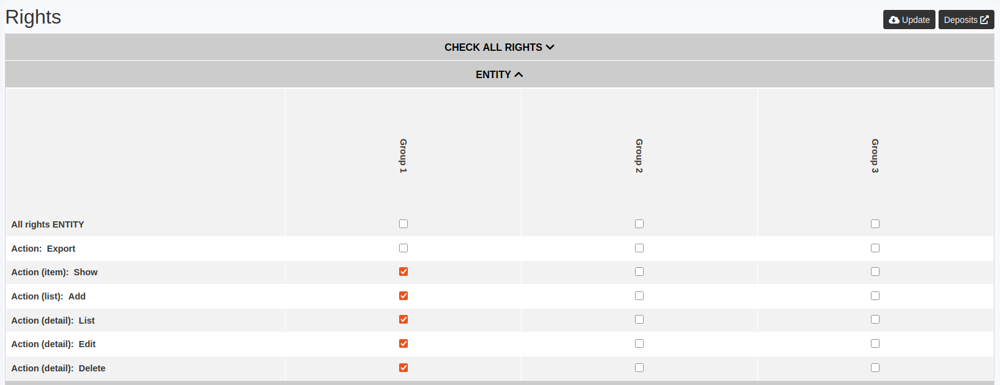

<h1 align="center">CredentialBundle</h1>

<p align="center">
    <a href="https://github.com/2lenet/CredentialBundle/actions" target="_blank">
        
    </a>
    <a href="https://github.com/2lenet/CredentialBundle/actions" target="_blank">
        
    </a>
    <a href="https://github.com/2lenet/CredentialBundle/actions" target="_blank">
        
    </a>
</p>

This bundle provides an easy credential manager to handle complex applications.

Its purpose is to facilitate the association between user groups and roles.



## Installation

```bash
composer require 2lenet/credential-bundle
```

## Setting up

Configure the `config/routes/credential.yaml` file:

```yaml
credential:
    resource: '@LleCredentialBundle/Resources/config/routes.yaml'
```

Next, generate the migration:

```bash
php bin/console make:migration
```

Check that the changes are correct and execute them:

```bash
php bin/console doctrine:migrations:migrate
```
